# Breaking CAPTCHA repository
This repository contains the report and code for our project in Scalable Machine Learning and Deep Learning (ID2223) at KTH.

The aim of the project is to break CAPTCHAs using deep learning technologies. Initially we focus on simple CAPTCHAs to evaluate the performance and move into more complex CAPTCHAs. The training dataset is generated from an open source CAPTCHA generation software. Tensorflow is used to create, train and test the network.

## Generating the dataset
The datasets is generated using a Java based CAPTCHA generator. The easiest way is to import the Java project into IntelliJ, compile, and execute  `breakingCAPTCHA/data_gen/src/kth/id2223/Main.java`. We have generated the following datasets.

| Description | Size | Training samples | Test samples |
|:------------|-----:|-----------------:|-------------:|
| Digits only | 38 MB | 9502 | 100 |
| Digits and characters | 197 MB | 49796 | 100 |
| Digits and characters with rotation | 39 MB | 10000 | 100 |
| Digits and characters with rotation | 198 MB | 49782 | 500 |
| Digits and characters with rotation | 777 MB | 196926 | 500 |

Each dataset contains jpeg images containing a CAPTCHA with five characters. The characters are lowercase letters (a-z) or numbers (0-9). We used the fonts "Arial" and "Courier" with and without rotation. An example of the created CAPTCHAs is displayed below. Our intention was to mimic the CAPTCHAs created by [Microsoft](https://courses.csail.mit.edu/6.857/2015/files/hong-lopezpineda-rajendran-recansens.pdf).

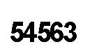 *Simple digit-only CAPTCHA*  
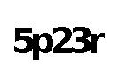 *Characters and digits without rotation*  
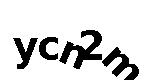 *Characters and digits with rotation*

## Executing the CNN
We have developed the code using Tensorflow 8.0 with Python 2.7.6 and Nvidia GPUs with CUDA 8.0. The CNN can be executed from the root folder of the project with
`cd simple_CNN` and
`PYTHONPATH=".." python CAPTCHA_cnn.py`.

After a successful training, the learned model is saved as `model.ckpt`.
Then you can use `PYTHONPATH=".." python restore_CAPTCHA_cnn.py filename.jpg` to predict an image file using the learned model.

## Results
#### First unsuccessful tries
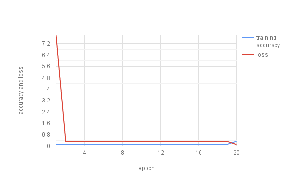  
*CNN with three conv. layers and two fully connected layers accuracy of CAPTCHAs with five digits or lowercase letters without rotation. Training in 100 batches and 10000 training samples.*

#### Digit-only CAPTCHAs
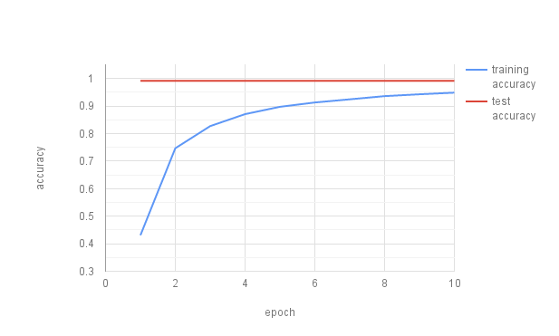  
*CNN with three conv. layers and two fully connected layers accuracy of CAPTCHAs with five digits without rotation. Training in 157 batches, 39250 training samples, and testing with 100 CAPTCHAs.*

#### Digit and letter CAPTCHAs
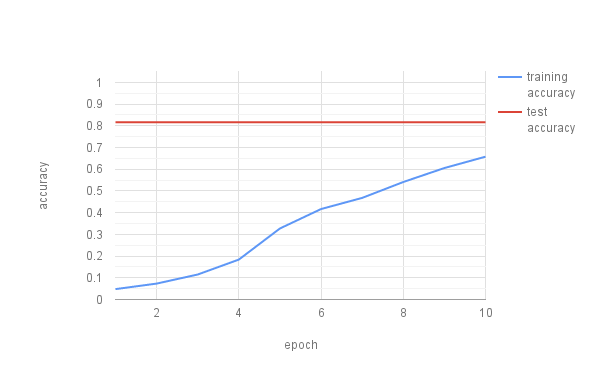  
*CNN with three conv. layers and two fully connected layers accuracy of CAPTCHAs with five digits or lowercase letters without rotation. Training in 199 batches, 49750 training samples, and testing with 500 CAPTCHAs.*

#### Digit and letter CAPTCHAs with rotation
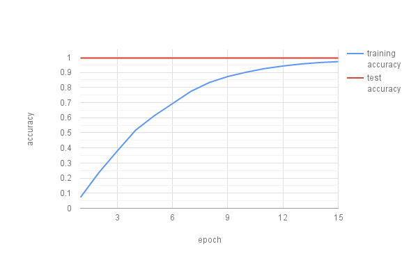  
*CNN with three conv. layers and two fully connected layers accuracy of CAPTCHAs with five digits or lowercase letters with rotation. Training in 787 batches, 196926 training samples, and testing with 500 CAPTCHAs.*

#### Examples of correct and false predictions
**Correct**  
 prediction: 54563  
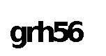 prediction: grh56  
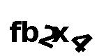 prediction: fb2x4

**False**  
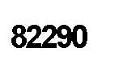 prediction: 8229**8**  
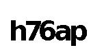 prediction: **k**76ap  
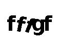 prediction: fffg**r**

## Report
We have compiled a full blog-style [report](report/CAPTCHA-report.md) with more details. Selected results can be found in the [results folder](https://github.com/tharidu/breakingcaptcha/tree/master/report/results).
