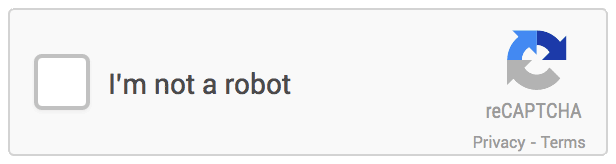
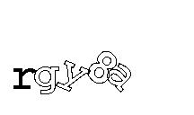

# Using deep learning to automatically break captchas
## Introduction
Completely Automated Public Turing test to tell Computers and Humans Apart (CAPTCHA) is a way of differentiating humans and machines and was coined by von Ahn, Blum, Hopper, and Langford [5]. The core idea is that reading distorted letters, numbers, or images is achievable for a human but very hard or impossible for a computer. Captchas might look like the two below. Most likely the reader has already seen one, when trying to register at a website or write a comment online.

*Simple captcha with two different fonts and slight rotation*

*reCAPTCHA example with two words, rotation and distortion*

There are several use cases for captchas, which includes the ones presented in [6]:
- Preventing comment spam
- Protect website registration
- Protect e-mail addresses from scrappers
- Online polls
- Preventing Dictionary Attacks
- Search Engine Bots

Captchas do not give a guarantee that it prevents these cases every time as there are known attack vectors. These include cheap or unwitting human labor, insecure implementation, and machine learning based attacks. We will not go into detail on insecure implementations, as the focus of this article are deep learning based approaches.

### Human based captcha breaking
Out of curiosity and comparability to machine learning approaches, we take a look at the human based approach. For example [BypassCaptcha](http://bypasscaptcha.com/order1.php) offers breaking captchas with cheap human labor in packages (e.g. 20,000 captchas for 130$). There are also other services including [Image Typerz](http://www.imagetyperz.com/Forms/bypasscaptcha.aspx), [ExpertDecoders](http://expertdecoders.com/), and [9kw.eu](https://www.9kw.eu/). There are also hybrid solutions that use both OCR and human labor like [DeathByCaptcha](http://deathbycaptcha.com/user/login). These vendors list the following accuracies and response times (averages):

| Service | Accuracy (daily average) | Response Time (daily average)|
|---------|---------:|--------------:|
| BypassCaptcha | N/A | N/A |
| Image Typerz | 95% | 10+ sec |
| ExpertDecoders | 85% | 12 sec |
| CaptchaBOSS (premium version of ExpertDecoders) | 99% | 8 sec |
| 9kw.eu | N/A | 30 sec |
| DeathByCaptcha | 96.8% | 10 sec |

The values are advertised and self-reported. We did not conduct any verification of the stated numbers, but it can give an orientation what a machine learning based approach should achieve.

### Learning based captcha breaking
Captchas are based on an unsolved AI problem. However, with the progress of AI techniques and computing power, sequences of characters or captchas can be recognized as shown by Goodfellow et al. in [1], Hong et al. in [2], Bursztein et al. in [3] and [7], and Stark et al. in [4] using deep learning techniques. Goodfellow et al. predict numbers from Goolge Street View images directly (without pre-processing) utilizing a CNN. They make use of  [DistBelief](https://research.google.com/pubs/pub40565.html) by Dean et al. to scale the learning to multiple computers and to avoid out of memory issues [1]. Hong et al. pre-process captchas to rotate them and segment the characters. Afterwards they apply a CNN with three convolutional layers and two fully connected layers [2]. Bursztein et al. use pre-processing, segmentation, and recognition techniques (based on KNN) and later on various CNNs to detect captchas from multiple websites including Baidu, Wikipedia, reCAPTCHA, and Yahoo [3],[7]. Stark et al. researched a way of detecting captchas with limited testing data. They use a technique called Active Learning to feed the network with new training data, that is ambiguous to improve the performance [4].

The below table gives an overview of their reported accuracies.

| Researcher | Dataset | Technique | Accuracy | Reference |
|-----------:|--------:|----------:|---------:|----------:|
| Goodfellow et al. | Google Street View image files | CNN with DistBelief | 96% | [1] |
| Hong et al. | Microsoft captchas | Preprocessing, segementation and CNN | 96% | [2] |
| Goodfellow et al. | Google Street View image files | CNN with DistBelief | 96% | [1] |
| Goodfellow et al. | Google Street View image files | CNN with DistBelief | 96% | [1] |
| Goodfellow et al. | Google Street View image files | CNN with DistBelief | 96% | [1] |

### Current state of captchas
As part of

## Our objectives and motivation
The aim of the project is to break captchas using deep learning technologies. Initially we focus on simple captchas to evaluate the performance and move into complex captchas. The training dataset will be generated from an open source captcha generation software. Tensorflow will be used to create and train a neural network.

## Creating the datasets
We are generating the datasets using a Java based captcha generator. We have generated the following datasets:
- training: 1000 images; testing: 100 images
- training: 5000 images; testing: 500 images
- training: 10000 images; testing: 1000 images
- training: 50000 images; testing: 5000 images
- training: 100000 images; testing: 10000 images
- training: 500000 images; testing: 50000 images
- training: 1000000 images; testing: 100000 images
- training: 5000000 images; testing: 500000 images

Each dataset contains jpeg images containing a captcha with five characters. The characters are lowercase (a-z) or numbers (0-9). We used the fonts "Arial" and "Courier" with noise. An example of the created captchas is displayed below. Our intention was to mimic the captchas created by [Microsoft](https://courses.csail.mit.edu/6.857/2015/files/hong-lopezpineda-rajendran-recansens.pdf).

## A naive approach to captcha breaking
As a first step we use quite simple captchas as displayed below.

## TBD: Our further things

## Conclusion

## References
1. Goodfellow, Ian J., et al. "Multi-digit number recognition from street view imagery using deep convolutional neural networks." arXiv preprint arXiv:1312.6082 (2013).
2. Hong, Colin et al. "Breaking Microsoft’s CAPTCHA." (2015).
3. "Using deep learning to break a Captcha system | Deep Learning." 3 Jan. 2016, https://deepmlblog.wordpress.com/2016/01/03/how-to-break-a-captcha-system/. Accessed 6 Dec. 2016.
4. Stark, Fabian, et al. "CAPTCHA Recognition with Active Deep Learning." Workshop New Challenges in Neural Computation 2015. 2015.
5. Von Ahn, Luis, et al. "CAPTCHA: Using hard AI problems for security." International Conference on the Theory and Applications of Cryptographic Techniques. Springer Berlin Heidelberg, 2003.
6. "CAPTCHA: Telling Humans and Computers Apart Automatically" 2010, http://www.captcha.net/. Accessed 7 Jan. 2017.
7. 	Elie Bursztein et al., "The end is nigh: generic solving of text-based CAPTCHAs". Proceedings of the 8th USENIX conference on Offensive Technologies, p.3-3, August 19, 2014, San Diego, CA
