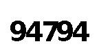
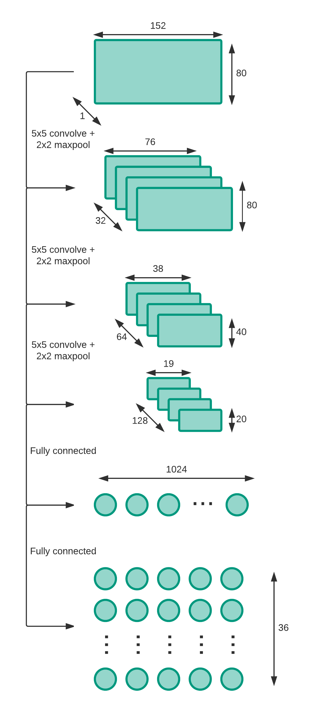

# Using deep learning to automatically break captchas
Completely Automated Public Turing test to tell Computers and Humans Apart (CAPTCHA) is a way of differentiating humans and machines and was coined by von Ahn, Blum, Hopper, and Langford [5]. The core idea is that reading distorted letters, numbers, or images is achievable for a human but very hard or impossible for a computer. Captchas might look like the one below. Most likely the reader has already seen one, when trying to register at a website or write a comment online.
   
*Simple captcha with two different fonts and slight rotation*

There are several use cases for captchas, which includes the ones presented in [6]:
- Preventing comment spam
- Protect website registration
- Protect e-mail addresses from scrappers
- Online polls
- Preventing Dictionary Attacks
- Search Engine Bots

Captchas do not give a guarantee that it prevents these cases every time as there are known attack vectors. These include cheap or unwitting human labor, insecure implementation, and machine learning based attacks. We will not go into detail on insecure implementations, as the focus of this article are deep learning based approaches.

### Human based captcha breaking
Out of curiosity and comparability to machine learning approaches, we take a look at the human based approach. For example [BypassCaptcha](http://bypasscaptcha.com/order1.php) offers breaking captchas with cheap human labor in packages (e.g. 20,000 captchas for 130$). There are also other services including [Image Typerz](http://www.imagetyperz.com/Forms/bypasscaptcha.aspx), [ExpertDecoders](http://expertdecoders.com/), and [9kw.eu](https://www.9kw.eu/). There are also hybrid solutions that use both OCR and human labor like [DeathByCaptcha](http://deathbycaptcha.com/user/login). These vendors list the following accuracies and response times (averages):

| Service | Accuracy (daily average) | Response Time (daily average)|
|---------|---------:|--------------:|
| BypassCaptcha | N/A | N/A |
| Image Typerz | 95% | 10+ sec |
| ExpertDecoders | 85% | 12 sec |
| CaptchaBOSS (premium version of ExpertDecoders) | 99% | 8 sec |
| 9kw.eu | N/A | 30 sec |
| DeathByCaptcha | 96.8% | 10 sec |

The values are advertised and self-reported. We did not conduct any verification of the stated numbers, but it can give an orientation on human performance and serves as a reference for our machine learning algorithms.

### Learning based captcha breaking
Captchas are based on an unsolved AI problem. However, with the progress of AI techniques and computing power, sequences of characters or captchas can be recognized as shown by Goodfellow et al. in [1], Hong et al. in [2], Bursztein et al. in [3] and [7], and Stark et al. in [4] using deep learning techniques. Goodfellow et al. predict numbers from Goolge Street View images directly (without pre-processing) utilizing a CNN. They make use of  [DistBelief](https://research.google.com/pubs/pub40565.html) by Dean et al. to scale the learning to multiple computers and to avoid out of memory issues [1]. This technique was later on used to solve captchas, whereby the researched achieved an [accuracy of up to 99.8%](http://www.zdnet.com/article/google-algorithm-busts-captcha-with-99-8-percent-accuracy/). Hong et al. pre-process captchas to rotate them and segment the characters. Afterwards they apply a CNN with three convolutional layers and two fully connected layers [2]. Bursztein et al. use pre-processing, segmentation, and recognition techniques (based on KNN) and later on various CNNs to detect captchas from multiple websites including Baidu, Wikipedia, reCAPTCHA, and Yahoo [3],[7]. Stark et al. researched a way of detecting captchas with limited testing data. They use a technique called Active Learning to feed the network with new training data, where the added data has a high classification uncertainty, to improve the performance overall [4]. The below table gives an overview of the reported accuracies in the different papers and blog posts.

| Researcher | Dataset | Technique | Accuracy (maximum) | Reference |
|-----------:|--------:|----------:|---------:|----------:|
| Goodfellow et al. | Google Street View image files | CNN with DistBelief | 96% | [1] |
| Hong et al. | Microsoft captchas | Preprocessing, segementation and CNN | 57% | [2] |
| Stark et al. | Cool PHP CAPTCHA generated captchas | CNN with Active Deep Learning | 90% | [4] |
| Bursztein et al. | Baidu, CNN, eBay, ReCAPTCHA, Wikipedia, Yahoo captchas | Reinforcement Learning, k-Nearest Neighbour | 54% (on Baidu) | [7] |
| Bursztein | Simple CAPTCHA | CNN | 92% | [3] |
| Bursztein | Simple CAPTCHA | RNN | 96% | [8] |

### Current state of captchas
Google has introduced [NoCAPTCHA](https://www.google.com/recaptcha/intro/index.html) in December 2014. This introduces multiply new features including evaluation based on cookies, movement of the mouse, and recognition of multiple images. Google announced to introduce an [invisible captcha](https://www.google.com/recaptcha/intro/comingsoon/invisiblebeta.html) to get rid of the checkbox.

  
 *Google NoCAPTCHA checkbox*

The previous version of [reCAPTCHA](https://security.googleblog.com/2014/12/are-you-robot-introducing-no-captcha.html) was very popular on many websites. It included typically two words with rotation and had an audio option.

  
*reCAPTCHA example with two words, rotation and distortion*

Further captcha techniques can include simple logic or math questions, image recognition, recognition of friends (social captcha), or user interaction (like playing a game) [9].

## Our objectives and motivation
The aim of the project is to break captchas using deep learning technologies without pre-segmentation. Initially we focus on simple captchas to evaluate the performance and move into complex captchas. The training dataset will be generated from an open source captcha generation software. Tensorflow will be used to create and train a neural network.

## Creating the datasets
We are generating the datasets using a Java based captcha generator ([SimpleCaptcha](http://simplecaptcha.sourceforge.net/)). We have created the following datasets.

| Description | Size | Training samples | Test samples |
|............:|.....:|.................:|.............:|
| Digits only | 38 MB | 9502 | 100 |
| Digits and characters | 197 MB | 49796 | 100 |
| Digits and characters with rotation | 198 MB | 49782 | 500 |
| Digits and characters with rotation | 777 MB | 196926 | 500 |

Each dataset contains jpeg images containing a captcha with five characters. The characters are lowercase (a-z) or numbers (0-9). We used the fonts "Arial" and "Courier" with noise. An example of the created captchas is displayed below. Our intention was to mimic the captchas created by [Microsoft](https://courses.csail.mit.edu/6.857/2015/files/hong-lopezpineda-rajendran-recansens.pdf).
We have extended SimpleCaptcha library in order to get character rotation, outlines in captchas to achieve the same look of Microsoft captchas.

Generated captchas will be 152x80 greyscale images. This resolution is chosen because it is small enough to reduce memory footprint when training the CNN and it is also enough to recognize the captcha easily.

 *Simple digit-only captcha* <\br>
 *Characters and digits without rotation* <\br>
 *Characters and digits with rotation*

## A naive approach to captcha breaking
As the first step we use quite simple captchas as displayed below.

Initially to validate our neural network model, 50K images of digits only captchas without any rotation or text effects were trained. Afterwards, alphanumeric captachs were used as the input for the CNN.

## Deep CNN model
We will be using a deep CNN with 3 ReLu layers and 2 fully connected layers to solve the captchas.
Each digit is represented by 36 neurons in the output layer.
The 3 convolutional layers with ReLu activation function have the sizes of 32, 64, and 128.
5x5 filter size was used in all layers. After each convolutional layer there is a max pooling of 2.
After the last convolutional layer, there is a fully connected layer with ReLu of size 1024 and finally another fully connected layer that has an output size of 180. In the ReLu layers, a dropout of 0.75 is applied.

In the output layer, digits 0-9 will be represented by 1 to 10 neurons and, characters a to z will be represented by 11 to 36 neurons. Therefore, there are 5 x 36 neurons which will identify the captcha. The network will output the predictions for all 5 digits and each digit is calculated by the max probability of its 36 neurons. We have set the learning rate as 0.001.

## Results and discussion
First, we trained the CNN with 10000 five character and digit captchas including rotation on a GTX660M. We had 100 batches with a batch size of 100 and ran it for 20 epochs. The hyperparameters were set as described in the previous section. The figure below shows that the network did not perform well with these settings. We then increased the training size to 50000 captchas, but the results stayed the same. We then tried with 10000 simplified captchas with only five digits without rotation. However, this still did not improve our situation. We noted that the loss function reduced quite quickly and stayed constant. We hence introduced another convolutional layer to the network to allow it to further differentiate the digits. Again, this resulted in almost the same result as displayed in the figure below.

  
*CNN with three conv. layers and two fully connected layers accuracy of captchas with 5 digits without rotation. Training with 100 batches and 10000 training samples.*

These results match the ones presented in [4]. The authors then introduce Active Learning to circumvent the problem. In [1] a larger amount of samples is used. However, we do not have sufficient computing power available to use millions of images as training data. Also, in [3] the batch size was larger, with working results. We decided to change our batch size, but required a larger GPU for that. Hence, we used a Nvidia Tesla K80 from AWS to conduct our training. We also changed the network back to three conv. layers and two fully connected layers. On the simple case with five digit captchas without rotation we used 39250 captchas in 157 batches and 10 epochs. We conducted testing with a very small dataset of 100 captchas. The results did improve considerably as shown in the figure below.

  
*CNN with three conv. layers and two fully connected layers accuracy of captchas with 5 digits without rotation. Training with 157 batches, 39250 training samples, and testing with 100 captchas.*

We then tried with a bit more complex captchas with digits and lowercase characters. We used 49750 training and 100 test captchas with the same CNN used in the simple case above. The figure below presents our results and shows that we can achieve an accuracy above 80% in these cases. We stopped the CNN prematurely after 10 epochs to go to more complex use cases.

  
*CNN with three conv. layers and two fully connected layers accuracy of captchas with 5 digits or lowercase characters without rotation. Training with 199 batches, 49750 training samples, and testing with 100 captchas.*

## Conclusion
With this project we have shown that it is possible to create large enough datasets automatically to mimic certain captchas (i.e. Microsoft). This provides then large labeled training samples to train neural networks. We have chosen to use two different CNNs with three and four convolutional layer and two fully connected layers. With a quite simple use of CNNs reasonable prediction results can be achieved.
However, we noticed that optimizing a CNN can be cumbersome. While running the CNN on a GTX 660M, we were not able to manage to get satisfying results. Most likely we would have needed more training time on the batches to receive better results. When we switched to a Tesla K80 we managed to train the network with larger amounts of data and a higher batch size. This resulted on the simple and more complex datasets in higher accuracy. We noticed that memory poses a quite large limitation towards applying large scale machine learning.
Our approach with a CNN is limited to captchas with exactly the length defined in the network. Hence, classifying captchas with any other length than five, would fail. As an alternative a RNN could be used to resolve this issue. In [8] a use of RNN to break captchas is discussed with fairly good results. However, also in this approach a powerful GPU is required.
Moreover, using a CNN requires large datasets to be trained on. For a combination of digits, characters, and rotation we required a dataset of around 200000 captchas (~780MB). On small sized GPU this datasets cause either out of memory errors or require a quite long training time.

## References
1. Goodfellow, Ian J., et al. "Multi-digit number recognition from street view imagery using deep convolutional neural networks." arXiv preprint arXiv:1312.6082 (2013).
2. Hong, Colin et al. "Breaking Microsoft’s CAPTCHA." (2015).
3. "Using deep learning to break a Captcha system | Deep Learning." 3 Jan. 2016, https://deepmlblog.wordpress.com/2016/01/03/how-to-break-a-captcha-system/. Accessed 6 Dec. 2016.
4. Stark, Fabian, et al. "CAPTCHA Recognition with Active Deep Learning." Workshop New Challenges in Neural Computation 2015. 2015.
5. Von Ahn, Luis, et al. "CAPTCHA: Using hard AI problems for security." International Conference on the Theory and Applications of Cryptographic Techniques. Springer Berlin Heidelberg, 2003.
6. "CAPTCHA: Telling Humans and Computers Apart Automatically" 2010, http://www.captcha.net/. Accessed 7 Jan. 2017.
7. 	Elie Bursztein et al., "The end is nigh: generic solving of text-based CAPTCHAs". Proceedings of the 8th USENIX conference on Offensive Technologies, p.3-3, August 19, 2014, San Diego, CA
8. "Recurrent neural networks for decoding CAPTCHAS | Deep Learning." 12 Jan. 2016, https://deepmlblog.wordpress.com/2016/01/12/recurrent-neural-networks-for-decoding-captchas/. Accessed 9 Jan. 2017.
9. "Captcha Alternatives and thoughts." 15 Dec. 2015, https://www.w3.org/WAI/GL/wiki/Captcha_Alternatives_and_thoughts. Accessed 9 Jan. 2017.
